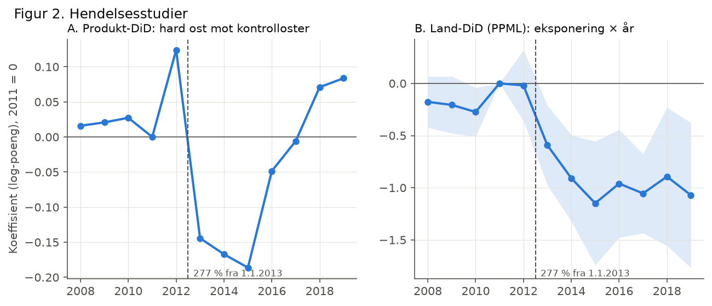
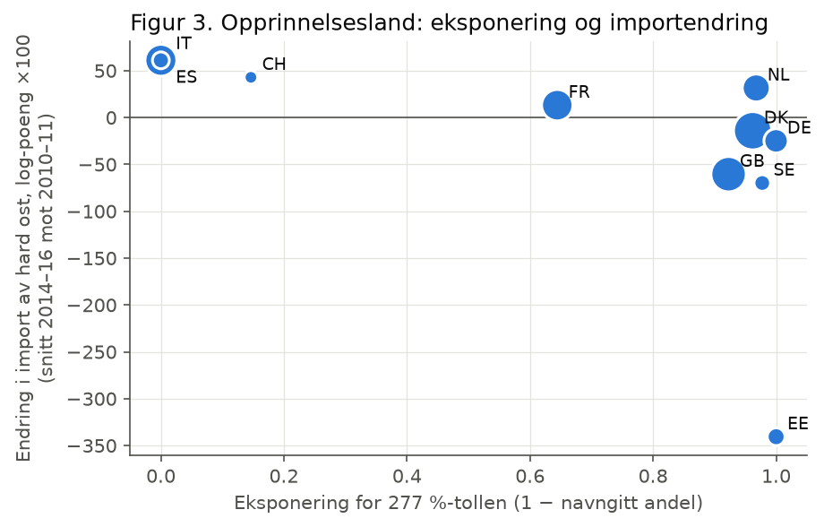

# Gruyère-unntaket: tollvern, etterspørsel og «elitistisk» osteimport

*Arbeidsutkast i masteroppgaveformat, 3. oktober 2026. Kapittel 6.4 (norsk mot importert ost) venter på data fra Landbruksdirektoratet.*

---

## Sammendrag

Fra 1. januar 2013 la Norge om tollen på hard og halvhard ost fra 27,15 kroner per kilo til 277 prosent av tollverdien. Fjorten navngitte oster – blant dem Gruyère, Parmigiano Reggiano, Comté og Manchego – ble unntatt og beholdt kronetollen. Omleggingen gjorde dermed ikke Gruyère dyrere; den gjorde alle andre importerte hardoster mye dyrere. Ved grensen gikk en navngitt ost fra å koste om lag 55 prosent mer enn en vanlig importert hardost til å koste om lag 40 prosent mindre (import utenfor kvote, 2013-verdier).

Vi bruker omleggingen som et naturlig eksperiment. Fordi Gruyère og de andre navngitte ostene ikke har eget varenummer før 2013, identifiserer vi effekten gjennom opprinnelsesland: land som i hovedsak eksporterer navngitte oster (Italia, Spania, Sveits), ble lite berørt, mens land som eksporterer vanlig hard ost (Danmark, Nederland, Tyskland, Storbritannia), ble fullt berørt. Hovedfunnene er:

- Et fullt eksponert land mistet om lag 55 prosent av sin hardost-eksport til Norge sammenlignet med et uberørt land (PPML, 2008–2019). Resultatet holder i de alternative spesifikasjonene (–41 til –69 prosent), og effekten har vart til 2025.
- Den implisitte egenpriselastisiteten for den rammede importen er minst –0,8 i absoluttverdi, og trolig høyere fordi deler av importen kom inn tollfritt innenfor EU-kvoten.
- De navngitte ostene har økt andelen sin av importen av hard ost fra 30 prosent i 2013 til 36 prosent i 2021. Importen av smelteost, som ikke ble omfattet av prosenttollen, nesten tredoblet seg etter reformen. Det tyder på at noe av importen ble klassifisert om eller erstattet.
- Vi finner ingen målbar effekt på konsumprisindeksen for ost, noe som er rimelig gitt at importen utgjør en liten del av forbruket og i stor grad går inn innenfor kvote.
- Vi finner ingen tollendring for Gruyère eller annen ost i 2024. Importen av navngitte oster fra Sveits er stabil i både mengde og pris gjennom 2023–2025.

Elastisiteten mellom norsk og importert ost kan ikke estimeres med SSB-data alene, fordi SSB ikke publiserer mengden norsk ost (produksjonsstatistikken er prikket). En etterspørselsmodell for importost med prisen på norsk ost som forklaringsvariabel gir en krysspriselastisitet med feil fortegn, og vi vurderer den som ikke identifisert. Modellen for norsk mot importert ost er satt opp og kjøres når serien for norsk ost fra Landbruksdirektoratets markedsrapporter er lagt inn. Den bør suppleres med målprisen for melk som instrument.

---

## 1. Innledning og problemstilling

Oppdraget er å måle priselastisiteten i etterspørselen etter ost i Norge, og særlig hvordan etterspørselen etter importert ost henger sammen med etterspørselen etter norskprodusert ost. Priselastisitet er den prosentvise endringen i etterspurt mengde når prisen øker med én prosent. Den er vanskelig å måle i observasjonsdata, fordi pris og mengde bestemmes samtidig av tilbud og etterspørsel. Vi trenger derfor prisendringer som skyldes noe utenfor markedet.

Tollomleggingen i 2013 er en slik endring. Den ble vedtatt politisk, den traff bare en del av ostene, og den traff dem kraftig. Den gir tre spørsmål som til sammen svarer på oppdraget:

1. Hvor mye falt importen av ost som fikk prosenttoll, sammenlignet med ost som slapp? (mengdeeffekten)
2. Hvor mye endret prisen seg for disse ostene? (priseffekten)
3. Hvor mye av etterspørselen flyttet seg til navngitte importoster, til andre ostetyper og til norsk ost? (substitusjon)

Forholdet mellom 1 og 2 gir elastisiteten. Spørsmål 3 avgjør hvordan den skal tolkes. Unntaket for Gruyère og de andre navngitte ostene gjør at spørsmålet om substitusjon også handler om fordeling: reformen gjorde de dyreste ostene relativt billigere.

## 2. Institusjonell bakgrunn

### 2.1 Tollvernet for ost

Norsk ost er beskyttet av toll og av tollkvoter. Innenfor EØS-avtalens artikkel 19 kan det importeres 7 200 tonn ost fra EU tollfritt. Kvoten fordeles ved auksjon. Utenfor kvoten betales ordinær toll. Tollen er derfor bindende bare for import utover kvoten, og den marginale importøren møter enten tollsatsen eller kvoteprisen.

### 2.2 Omleggingen i 2013

Regjeringen la fram forslaget om prosenttoll i statsbudsjettet 8. oktober 2012 (Prop. 1 LS (2012–2013)), og Stortinget vedtok det 27. november 2012. Fra 1. januar 2013 gjaldt følgende for hard og halvhard ost:

| Varenummer | Innhold | Toll før 2013 | Toll fra 2013 |
|---|---|---|---|
| 0406.90.92 | 14 navngitte oster: Appenzeller, Beaufort, Comté, Gamle Ole, Grana Padano, Gruyère, Le Vieux Pané, Morbier, Munster, Parmigiano Reggiano, Manchego, Pecorino, Saint Albray, Västerbotten | 27,15 kr/kg | 27,15 kr/kg |
| 0406.90.97 | Annen hard og halvhard ost, upasteurisert | 27,15 kr/kg | 277 % |
| 0406.90.98 | Annen hard og halvhard ost, pasteurisert | 27,15 kr/kg | 277 % |

*Tabell 2-1: Tollsatser utenfor kvote. Kilde: Stortingets tollvedtak for 2013; SSBs varenummerliste.*

Før 2013 lå alle disse ostene under 0406.90.91 og 0406.90.99. De navngitte ostene fikk eget varenummer først ved omleggingen. Øvrige ostetyper (fersk ost, revet ost, smelteost, blåmuggost, hvitmuggost og feta) beholdt kronetollen.

Prosenttollen er høyere enn kronetollen for alle oster med tollverdi over 9,80 kr/kg, det vil si praktisk talt all ost. Med en gjennomsnittlig tollverdi på 58 kr/kg for annen hard ost i 2013 steg prisen inkludert toll fra om lag 85 til om lag 220 kr/kg, en økning på 157 prosent. For navngitte oster, med tollverdi rundt 106 kr/kg, var prisen inkludert toll uendret på om lag 133 kr/kg.

### 2.3 Endringer etter 2013

I 2022 ble de navngitte ostene flyttet til 0406.90.93, og listen ble utvidet med blant annet britiske cheddar- og Caerphilly-oster. Prosenttollen som ble innført 1. januar 2024, gjaldt isbergsalat, knollselleri, rødbeter, kålrot og potet (Stortingets tollvedtak for 2024, vedlegg 4); vi har ikke funnet at den omfattet ost. Importdataene viser heller ikke noe brudd i 2024: importen av navngitte oster fra Sveits var 46 tonn i 2023, 45 tonn i 2024 og 53 tonn i 2025, med tollverdi på 245–253 kr/kg. Vi har ikke hatt tilgang til Lovdata eller Tolletatens nettsider fra analysemiljøet, og dette bør kontrolleres mot tolltariffen.

## 3. Teori og hypoteser

Vi tenker oss at forbrukerne fordeler osteutgiftene i to trinn (Armington, 1969). Først velger de mellom norsk og importert ost; deretter fordeler de importen mellom ostetyper. Substitusjonselastisiteten på hvert trinn angir hvor lett forbrukerne bytter når de relative prisene endres.

Reformen endret de relative prisene på det nederste trinnet kraftig, og det gir tre hypoteser:

- **H1 (egenpris):** Importen av annen hard ost faller sammenlignet med import som ikke ble rammet.
- **H2 (substitusjon mot «elitistisk» ost):** Andelen navngitte oster øker. Unntaket virker som en relativ subsidie til de dyreste ostene.
- **H3 (kvalitet):** En kronetoll gjør billig ost relativt dyrere enn dyr ost og trekker sammensetningen mot høyere kvalitet (Alchian og Allen, 1964; Hummels og Skiba, 2004). En prosenttoll gjør ikke det. Innenfor de rammede varenumrene skulle den gjennomsnittlige tollverdien derfor ikke stige, og den kan falle.

I tillegg forventer vi at importørene tilpasser seg ved å fremskynde import før reformen og ved å flytte import til varenumre med kronetoll, for eksempel smelteost.

## 4. Data

Alle data er hentet fra SSBs statistikkbank 3. oktober 2026 og er dokumentert i `data/README.md`. Vi bruker:

- SSB tabell 08801: årlig import etter varenummer (HS, 8 siffer) og land, 2008–2025, mengde (kg) og verdi (kr, CIF uten toll)
- SSB tabell 08799: samme, månedlig, for 2011–2014 og 2022–2026
- SSB tabell 14700: KPI for ost (01.1.4.5), matvarer (01.1) og totalt, månedlig 2008–2026

Vi har kontrollert uttrekkene på tre måter. Summen over landene dekker 98–100 prosent av totalen per varenummer og år. Månedstallene summerer seg nøyaktig til årstallene. Samlet osteimport ifølge SSB (20 041 tonn i 2024 og 20 693 tonn i 2025) stemmer med Landbruksdirektoratets markedsrapport (20 041 og 20 683 tonn).

Analysevinduet er 2008–2019. Det slutter før pandemien og før omkodingene i 2020 (blåmuggliknende oster flyttet til 0406.40) og 2022 (ny navneliste). Som robusthetssjekk forlenger vi landanalysen til 2025.

**Datahull.** SSBs produksjonsstatistikk for ost (tabell 10455, Prodcom 10.51.40) er prikket fra og med 2010 fordi én aktør dominerer markedet. Mengden norsk ost solgt i Norge må derfor hentes fra Landbruksdirektoratets årlige markedsrapport.

## 5. Empirisk strategi

### 5.1 Eksponering etter opprinnelsesland

Vi kan ikke observere Gruyère før 2013, men vi kan observere hvor osten kommer fra. Vi definerer hvert lands eksponering for prosenttollen som

  E_c = 1 – min(1, navngitt import fra land c i 2013 / import av hard ost fra land c i 2010–2011).

Telleren er målt etter reformen, men gjelder ostene som ikke fikk ny toll; nevneren er målt før reformen. Utvalget er de ti landene med mer enn 20 tonn årlig hardost-eksport til Norge i 2008–2011. De dekker 98–100 prosent av importen av hard ost før reformen og 93–97 prosent etter.

| Land | Import av hard ost 2010–11 (tonn per år) | Navngitt 2013 (tonn) | Eksponering |
|---|---|---|---|
| Italia | 329 | 388 | 0,00 |
| Spania | 75 | 92 | 0,00 |
| Sveits | 39 | 34 | 0,15 |
| Frankrike | 318 | 113 | 0,64 |
| Storbritannia | 411 | 32 | 0,92 |
| Danmark | 488 | 19 | 0,96 |
| Nederland | 247 | 8 | 0,97 |
| Sverige | 71 | 2 | 0,98 |
| Tyskland | 181 | 0 | 1,00 |
| Estland | 86 | 0 | 1,00 |

*Tabell 5-1: Eksponering for prosenttollen. Kilde: SSB tabell 08801, egne beregninger.*

### 5.2 Estimeringsmodell

Hovedmodellen er en difference-in-differences med kontinuerlig behandlingsintensitet, estimert med Poisson pseudo-maximum likelihood (PPML), som er standard for handelsstrømmer med mange små og noen null-observasjoner (Santos Silva og Tenreyro, 2006):

  E[import_ct] = exp(α_c + δ_t + β · E_c · Post_t + γ · E_c · 1[t = 2012])

α_c og δ_t er land- og årsfaste effekter. β måler den relative endringen i import for et fullt eksponert land, og exp(β) – 1 kan leses som prosentvis effekt. γ fanger opp eventuell fremskyndet import i 2012. I en hendelsesstudie erstatter vi Post_t med én dummy per år (2011 = referanse).

Med bare ti land er standard klyngerobuste standardfeil upålitelige. Vi rapporterer derfor også randomiseringsinferens (2 000 permutasjoner av eksponeringen mellom land) og wild cluster bootstrap med Webb-vekter (Cameron mfl., 2008; Webb, 2023).

### 5.3 Fra mengdeeffekt til elastisitet

Elastisiteten er forholdet mellom mengdeeffekten og priseffekten (en Wald-estimator):

  ε = β / Δln P.

Prisøkningen avhenger av hvor stor andel s av den rammede importen som kom inn tollfritt innenfor kvote. Denne andelen observeres ikke i SSB-data. Vi viser derfor ε for ulike verdier av s. Med s = 0 er prisøkningen størst, og elastisiteten minst i absoluttverdi; det gir en nedre grense.

### 5.4 Norsk mot importert ost

På det øverste trinnet estimerer vi

  ln(M_t / D_t) = a + σ · ln(P_D,t / P_M,t) + b · t + u_t,

der M er all osteimport, D er norsk ost solgt i Norge, P_D er KPI for ost og P_M er importens enhetsverdi. σ er substitusjonselastisiteten mellom norsk og importert ost. Fordi relative priser og mengder bestemmes samtidig, instrumenterer vi den relative prisen med reformen. Målprisen for melk, som fastsettes i jordbruksoppgjøret, kan brukes som et ekstra instrument for norsk pris.

### 5.5 Etterspørsel etter importost med pris på norsk ost

Inntil mengden norsk ost er på plass, estimerer vi en etterspørselsfunksjon for importost som tar med prisen på norsk ost. Vi bruker et panel med ni ostekategorier i 2008–2025:

  ln(q_gt / N_t) = α_g + ε_egen · ln(P_gt / KPI_t) + ε_norsk · ln(KPI ost_t / KPI_t) + η · ln(Y_t / (N_t · KPI_t)) + u_gt

Her er q importmengden i kategori g, N folkemengden, P tollbelastet importpris utenfor kvote, KPI ost prisen på ost i Norge (som domineres av norsk ost) og Y husholdningenes disponible inntekt. Egenprisen instrumenteres med en tollfaktor som bare varierer med tollvedtakene. Kronetollen på 27,15 kr/kg er nominelt fast og blir realt lavere år for år. Hard ost fikk i tillegg 277 prosent på den rammede andelen fra 2013. Krysspriselastisiteten ε_norsk identifiseres bare fra variasjonen over tid i realprisen på ost, og vi behandler den prisen som bestemt utenfor importmarkedet, fordi den i stor grad følger målprisen i jordbruksoppgjøret.

## 6. Resultater

### 6.1 Mengdeeffekt etter opprinnelsesland

| Spesifikasjon | β | Effekt ved full eksponering | p (klynge) | p (randomisering / bootstrap) |
|---|---|---|---|---|
| PPML, mengde (hovedmodell) | –0,79 | –55 % | 0,001 | 0,059 (RI) |
| PPML, eksponering målt 2013–14 | –0,90 | –59 % | 0,001 | – |
| PPML, uten 2012 | –0,80 | –55 % | 0,001 | – |
| PPML, landspesifikke trender | –0,52 | –41 % | <0,001 | – |
| OLS, log mengde | –1,18 | –69 % | 0,021 | 0,071 (WCB) |
| OLS, log mengde, vektet | –0,95 | –61 % | 0,002 | 0,089 (WCB) |
| OLS, log enhetsverdi | +0,11 | +11 % | 0,28 | 0,33 (WCB) |

*Tabell 6-1: Effekt av prosenttollen på import av hard ost, 2008–2019. Kilde: `results/did_land.csv`.*

Et fullt eksponert land mistet om lag 55 prosent av sin hardost-eksport til Norge sammenlignet med et uberørt land. Effekten er stabil når ett og ett land utelates (–48 til –62 prosent). Med randomiseringsinferens og bootstrap, som er de mest pålitelige med ti land, er p-verdiene 0,06–0,09. Det er svakere enn de klyngerobuste p-verdiene og bør leses som moderat sterk statistisk støtte.

Hendelsesstudien (figur 2B) viser et klart brudd i 2013. Effekten bygger seg opp over to–tre år og blir liggende. Forlenget til 2025 (figur 7) er effekten om lag –75 til –80 prosent; tallene etter 2020 påvirkes av omkodinger og bør tolkes forsiktig.

Enhetsverdiene stiger litt mer for eksponerte land, men forskjellen er ikke signifikant. Det gir ikke støtte til hypotese H3 i noen retning.

### 6.2 Produktnivå: hard ost mot andre ostetyper

Sammenlignet med seks ostetyper som beholdt kronetollen, falt den samlede importen av hard ost bare med om lag 7 prosent, og effekten er ikke signifikant. Det skyldes at det samlede tallet også inneholder de navngitte ostene, som økte, og at nedgangen for annen hard ost var størst i 2013–2015 (figur 2A). Analysen på produktnivå er derfor et svakt mål på reformen; landanalysen skiller bedre mellom ostene som ble rammet og ostene som slapp.

Smelteost økte derimot med 178 prosent sammenlignet med kontrollgruppen, og revet ost med 43 prosent. Med seks kontrollkategorier er den lavest mulige p-verdien fra placebotesten 0,14, som er det vi får. Månedstallene (figur 5) viser at importen av smelteost tok seg opp fra mai 2013, fra om lag 28 til 76 tonn per måned. Det er forenlig med at importører har flyttet volum til en varekategori med kronetoll.

### 6.3 Elastisitet

| Andel av rammet import innenfor kvote (s) | Prisøkning (Δln P) | Elastisitet ε | 95 % konfidensintervall |
|---|---|---|---|
| 0 | 0,94 | –0,84 | –1,33 til –0,35 |
| 0,25 | 0,82 | –0,96 | –1,52 til –0,41 |
| 0,50 | 0,66 | –1,20 | –1,90 til –0,51 |
| 0,75 | 0,42 | –1,91 | –3,02 til –0,80 |

*Tabell 6-2: Egenpriselastisitet for import av annen hard ost. Kilde: `results/elastisitet_import.csv`.*

Elastisiteten er minst –0,8 i absoluttverdi. Hvis halvparten av den rammede importen gikk inn tollfritt innenfor kvoten, er den om lag –1,2. Landbruksdirektoratets tall for kvotebruk vil kunne snevre inn intervallet.

To forbehold gjelder. For det første er estimatet relativt: det måler importen fra eksponerte land sammenlignet med uberørte land. Hvis forbrukerne flyttet seg til navngitte oster, økte importen fra de uberørte landene, og β blander da egenpris- og krysspriseffekter. Det trekker estimatet opp i absoluttverdi. For det andre er prisen målt ved grensen. Hvor stor del av tollen som slo ut i butikkprisen, vet vi ikke.

### 6.4 Norsk mot importert ost

Substitusjonselastisiteten mellom norsk og importert ost (kapittel 5.4) venter på data. Modellen er implementert i `analyse.py` (avsnitt 7) og kjører når `data/manuelt_norsk_ost.csv` har minst ti år med norsk ost solgt i Norge.

I mellomtiden har vi estimert etterspørselen etter importost med prisen på norsk ost som forklaringsvariabel (kapittel 5.5):

| Spesifikasjon | Egenpris | Krysspris mot norsk ost | Inntekt |
|---|---|---|---|
| IV, grunnmodell | –0,23 (0,03) | –1,56 (0,46) | 2,65 (0,17) |
| IV, felles trend | –0,22 (0,03) | –1,15 (0,24) | 1,64 (0,20) |
| IV, kategorispesifikke trender | –0,33 (0,03) | –1,09 (0,25) | 1,61 (0,19) |
| OLS, grunnmodell | –0,52 (0,04) | –1,50 (0,55) | 2,83 (0,20) |

*Tabell 6-3: Elastisiteter i etterspørselen etter importost, ni kategorier, 2008–2025 (n = 162). Standardfeil klynget på år i parentes. Kilde: `results/ettersporsel_import.csv`.*

Egenpriselastisiteten er –0,2 til –0,3 med tollfaktoren som instrument. Det er lavere i absoluttverdi enn estimatet fra landanalysen (–0,8 eller høyere). Forskjellen er ventet: kategorien hard ost inneholder også de navngitte ostene, og prisen er målt som om all import betalte full toll, noe som overdriver prisendringen og trekker elastisiteten mot null. Vi tolker derfor –0,2 til –0,3 som en nedre grense og landanalysen som det beste anslaget.

Krysspriselastisiteten mot norsk ost har feil fortegn. Står den til troende, skulle importen falle når norsk ost blir relativt dyrere, og det er ikke forenlig med at norsk og importert ost er substitutter. Vi tolker resultatet slik at den er dårlig identifisert. Realprisen på ost har bare 18 årsobservasjoner og varierer lite (mellom –7 og +3 prosent fra nivået i 2025). Fra 2015 til 2022 falt den med om lag 7 prosent, samtidig som importen vokste kraftig av andre grunner, blant annet fordi grensehandelen var stengt i 2020–2021. Modellen tilskriver da importveksten prisfallet. Inntektselastisiteten på 1,6–2,8 fanger trolig også opp den underliggende veksten i etterspørselen etter importost, ikke bare inntektseffekten. For å anslå krysspriselastisiteten troverdig trenger vi mengden norsk ost og et eksogent skift i norsk pris, for eksempel endringer i målprisen for melk fra jordbruksoppgjøret.

### 6.5 Sammensetning, fremskyndet import og konsumpriser

De navngitte ostene økte andelen av importen av hard ost fra 30 prosent i 2013 til 34 prosent i 2019 og 36 prosent i 2021 (figur 4). De vokste med 7,6 prosent per år i 2013–2019, mot 4,8 prosent for annen hard ost. Sveitsiske navngitte oster, som i praksis er Gruyère og Appenzeller, vokste med 2,9 prosent per år. Veksten i «elitistisk» ost er altså drevet av italiensk Grana Padano og Parmigiano Reggiano, ikke av Gruyère.

Importen av hard ost var høy gjennom hele 2012. Veksten var 17,5 prosent i januar–september og 21,4 prosent i oktober–desember, etter at forslaget ble kjent. Fremskyndingen etter kunngjøringen tilsvarer om lag 28 tonn, mens importen i første kvartal 2013 lå om lag 194 tonn under trenden.

Vi finner ingen effekt på KPI for ost relativt til KPI for matvarer (nivåskift +1,4 indekspoeng, p = 0,50).

## 7. Robusthet og identifikasjon

Den sentrale antagelsen er at eksponerte og uberørte land ville hatt parallelle trender uten reformen. En felles test av koeffisientene for 2008–2010 gir p = 0,065. Koeffisientene før reformen er negative (–0,18 til –0,27), det vil si at eksponerte land vokste noe raskere enn uberørte land før 2011. Hvis denne trenden hadde fortsatt, ville effekten vært større, ikke mindre: trendkorrigert er gjennomsnittseffekten i 2013–2019 –69 prosent mot –61 prosent ukorrigert. Effekten forsvinner først hvis eksponerte land fra 2011 hadde en relativ trend på –0,19 log-poeng per år, fire ganger større enn trenden før reformen og med motsatt fortegn (jf. Rambachan og Roth, 2023).

En annen trussel er at andre forhold endret seg samtidig for de samme landene. Importen fra Danmark økte med om lag 28 prosent i 2011. Det kan ha sammenheng med smørkrisen høsten 2011, men vi har ikke undersøkt dette nærmere; et høyt referanseår vil i så fall gjøre koeffisientene før reformen mer negative uten å påvirke effekten etter reformen vesentlig. Storbritannias utmelding av EU berører ikke vinduet 2008–2019. Jackknife-testen viser at ingen enkeltland driver resultatet.

## 8. Diskusjon og begrensninger

Reformen hadde en stor og varig effekt på importen av vanlig hard ost, og den forskjøv importen mot de navngitte ostene. Unntaket for Gruyère og de andre navngitte ostene skjermet oster som i liten grad konkurrerer med norsk gulost, men det gjorde samtidig de dyreste importostene relativt billigere.

Analysen har fire viktige begrensninger. Vi observerer ikke kvotebruken, og elastisiteten er derfor et intervall. Prisene er målt ved grensen og ikke i butikk. Vi har bare ti land, slik at statistisk usikkerhet må vurderes med randomiseringsinferens. Og vi mangler ennå den norske siden av markedet.

## 9. Videre arbeid

1. Legge inn norsk ost solgt i Norge 2008–2025 fra Landbruksdirektoratets markedsrapporter og estimere substitusjonselastisiteten mellom norsk og importert ost (kapittel 5.4).
2. Hente målprisen for melk (jordbruksavtalene 2008–2025) som instrument for prisen på norsk ost.
3. Hente kvotebruk og kvotepriser for EU-ostekvoten fra Landbruksdirektoratet for å snevre inn elastisitetsintervallet.
4. Kontrollere tollsatsene 2013–2026 mot tolltariffen (Lovdata, Tolletaten), særlig for 2024.
5. Vurdere månedlige data for hele perioden 2008–2019 for å styrke hendelsesstudien.

## Referanser

- Alchian, A. A. og Allen, W. R. (1964). *University Economics*. Wadsworth.
- Armington, P. S. (1969). A theory of demand for products distinguished by place of production. *IMF Staff Papers*, 16(1), 159–178.
- Cameron, A. C., Gelbach, J. B. og Miller, D. L. (2008). Bootstrap-based improvements for inference with clustered errors. *Review of Economics and Statistics*, 90(3), 414–427.
- Hummels, D. og Skiba, A. (2004). Shipping the good apples out? An empirical confirmation of the Alchian–Allen conjecture. *Journal of Political Economy*, 112(6), 1384–1402.
- Landbruksdirektoratet (2026). *Markedsrapport 2025*.
- Prop. 1 LS (2012–2013). *Skatter, avgifter og toll 2013*. Finansdepartementet.
- Rambachan, A. og Roth, J. (2023). A more credible approach to parallel trends. *Review of Economic Studies*, 90(5), 2555–2591.
- Santos Silva, J. M. C. og Tenreyro, S. (2006). The log of gravity. *Review of Economics and Statistics*, 88(4), 641–658.
- SSB (2026). Statistikkbanken, tabell 06913, 08799, 08801, 10455, 10799 og 14700. Uttak 3. oktober 2026.
- Stortinget (2012). Stortingsvedtak om toll for budsjettåret 2013, 27. november 2012.
- Stortinget (2023). Stortingsvedtak om tollavgift for 2024, 14. desember 2023, vedlegg 4.
- Webb, M. D. (2023). Reworking wild bootstrap-based inference for clustered errors. *Canadian Journal of Economics*, 56(3), 839–858.
